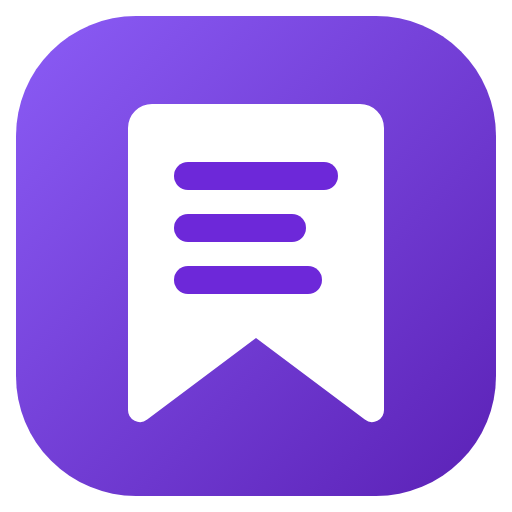
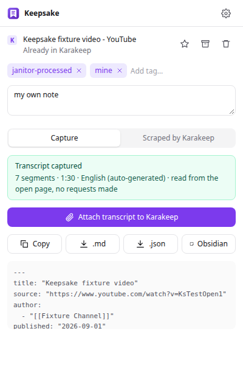
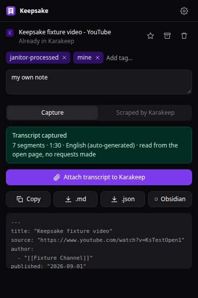

<p align="center"></p>

# Keepsake

A browser extension for [Karakeep](https://karakeep.app). One click on the toolbar button:

- **saves the tab** to Karakeep (automatically, or after you confirm), then shows its
  **tags, lists and note** for editing, and the **copy Karakeep scraped**;
- **captures the page as Markdown**, using the same engine as Obsidian Web Clipper
  ([Defuddle](https://github.com/kepano/defuddle));
- on YouTube, **captures the transcript already shown on the page**, with timestamps,
  chapters, language, title, canonical URL and video id. Keepsake itself makes **no requests
  to YouTube**: no caption fetch, no API fallback. If the transcript panel is closed, it clicks
  YouTube's own **Show transcript** button (setting *Open YouTube transcript automatically*,
  on by default), so YouTube loads it exactly as after a manual click. With the setting off,
  it asks you to open the panel and retry.

Captures can be copied, downloaded as Markdown or JSON, sent to Obsidian, or attached
to the Karakeep bookmark. Karakeep is the single store for transcripts: the brain_janitor
jobs read them from there and upload their own API fallback there too
(see [integration/hermes](integration/hermes/INSTALL.md)).

<p align="center">
  
  
</p>

## Install

Needs Node 24 and pnpm.

```sh
pnpm install
pnpm build            # Chrome/Chromium/Edge → .output/chrome-mv3
pnpm build:firefox    # Firefox → .output/firefox-mv3
```

- **Chrome:** open `chrome://extensions`, enable Developer mode, **Load unpacked**, pick
  `.output/chrome-mv3`.
- **Firefox:** install `keepsake-<version>.xpi` from the
  [latest release](https://github.com/MatCer/keepsake/releases/latest) once. Firefox then updates it
  itself (it checks about once a day; *Check for Updates* in `about:addons` forces it). To ship a version,
  publish a GitHub Release tagged `vX.Y.Z` (higher than the last one, e.g.
  `gh release create v0.3.0 --generate-notes`).
  [`release-firefox.yml`](.github/workflows/release-firefox.yml) then has Mozilla sign it as an
  unlisted add-on and attaches the `.xpi` and `updates.json` to that release. It needs the repository secrets
  `AMO_JWT_ISSUER` and `AMO_JWT_SECRET` (addons.mozilla.org → Developer Hub → Manage API Keys).
  For local testing: `about:debugging#/runtime/this-firefox` → **Load Temporary Add-on** →
  `.output/firefox-mv3/manifest.json`.

## Configure

Click the gear in the popup (or the extension's Options):

| setting | meaning |
|---|---|
| Server address | Your Karakeep URL. HTTPS, or HTTP only for localhost/LAN addresses. The browser asks once for permission to reach exactly that origin. |
| Email & password / API key | Password sign-in exchanges your credentials for an API key, as the official Karakeep extension does. The key is kept in this browser profile's local extension storage. It is never synced, exported or logged. |
| Logged in as / Sign out | Shows the Karakeep account. Sign out forgets the key; revoke it in Karakeep under Settings → API Keys. |
| Auto-save on open | On: the tab is saved when the popup opens. Off: you confirm before saving. |
| Auto-attach transcripts | On (default): a captured YouTube transcript is attached to the bookmark when the popup opens. Replacing a different transcript still asks first. Off: click **Attach**. |
| Tag transcripts | Optional tag added when a transcript is attached. |
| Theme | System, light or dark. |
| Obsidian vault / folder | Shows an **Obsidian** button that copies the Markdown and opens `obsidian://new…&clipboard`, the same way Obsidian Web Clipper does. |

## Using it on YouTube

1. Open the video. (With *Open YouTube transcript automatically* off, also click **…more**
   under it, then **Show transcript**.)
2. Click the Keepsake button. The Capture tab says **Transcript captured** with the segment count and language.
3. With **Auto-attach** on it is attached right away; otherwise **Attach transcript to Karakeep** stores it on the bookmark as an attachment named
   `keepsake-transcript-<videoId>-<lang>-<hash>.html`. Clicking again does nothing: the
   same transcript is already attached. A *different* transcript in the same language
   is only replaced after you confirm.

Other states you can see: *Open the transcript first*, *No captions on this video*,
*The page is still switching videos* (the transcript belongs to the previous video in
YouTube's single-page navigation), *Too large to capture*, *Nothing to capture here*.
If Karakeep rejects an upload after 3 attempts, the capture goes to an outbox shown in the
popup with **Retry now**. Nothing is dropped silently.

## How Karakeep stores the transcript

Checked against the deployed Karakeep **0.32.0**, both in its source and on a local
0.32.0 instance. The API refuses to attach anything as `linkHtmlContent` (HTTP 400), so
the scraped copy can't be overwritten. Keepsake uploads the transcript as a `text/html`
asset and attaches it as `userUploaded`. It shows up under Attachments, and the note,
tags, metadata and scraped content stay unchanged. Karakeep serves the file with
`Content-Security-Policy: sandbox; default-src 'none'`. The full reasoning is in
[docs/ARCHITECTURE.md](docs/ARCHITECTURE.md).

## Permissions

`activeTab`, `scripting`, `storage`, plus runtime access to your Karakeep origin only.
There are no content scripts, no background polling, and no access to cookies, history
or other tabs. Page reading happens only when you open the popup.

## Tests

```sh
pnpm test                                               # unit tests (vitest)
python3 -m unittest discover -s integration/hermes/tests  # importer + prefetch patch
scripts/karakeep-local.sh up && pnpm test:e2e           # Playwright + local Karakeep 0.32.0
```

The e2e suite loads the built extension in Chromium and serves a fixture page at a real
`https://www.youtube.com/watch?v=…` URL through request interception. Every other request
is blocked and recorded, and the Chrome DevTools Protocol logs all traffic from the
YouTube tab and the popup. It asserts:

- zero YouTube/caption requests while capturing;
- the unopened-panel instruction appears and no transcript is created;
- the exact segments, timestamps and chapters arrive in Karakeep;
- the prefetch job skips the captured video, fetches an uncaptured one through a stub and
  uploads it to Karakeep, `get` reads from Karakeep, and no local transcript files exist;
- a duplicate click leaves one bookmark, one attachment, and the original note and tags.

The local Karakeep runs with its crawler disabled and a dead proxy, so bookmarking test
YouTube URLs never contacts YouTube.

## Rollback

- **Extension:** remove or disable it in `chrome://extensions` / `about:addons`. It stores
  nothing outside its own extension storage.
- **Karakeep:** Keepsake only adds attachments named `keepsake-transcript-*.html` (and the
  optional transcript tag). Delete them from the bookmark's Attachments. Bookmarks it
  created are ordinary link bookmarks.
- **brain_janitor:** see the Rollback section of
  [integration/hermes/INSTALL.md](integration/hermes/INSTALL.md): restore the two `.bak`
  scripts and delete `karakeep_transcripts.py`. Attachments stay in Karakeep and are harmless.

## License

MIT
